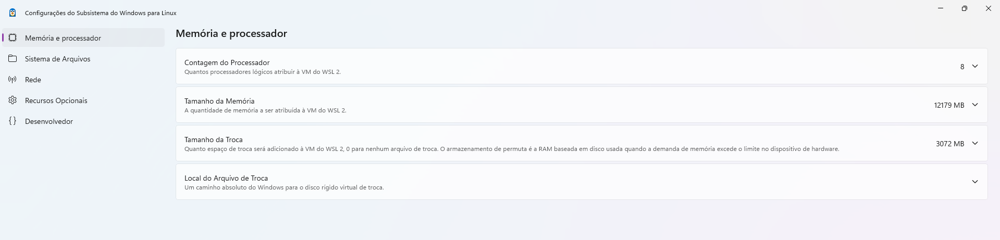
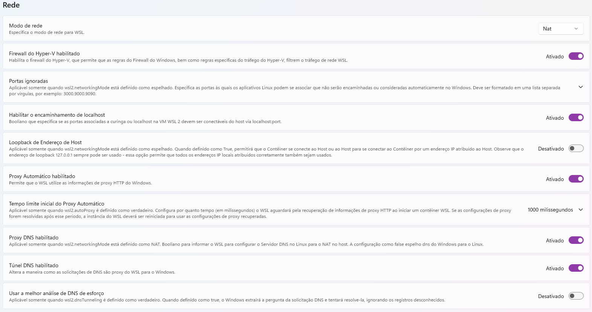

## WSL verificar memória

```bash
free -h
```

Exemplo:
```bash
               total        used        free      shared  buff/cache   available
Mem:            11Gi       2.4Gi       2.3Gi        42Mi       7.2Gi       9.2Gi
Swap:          3.0Gi          0B       3.0Gi
```




Verificando memória do docker
```bash
cat /proc/meminfo | grep MemTotal
```
Exemplo: 
```bash
MemTotal:       12140564 kB
```

Verificar memória do daemon
```bash
docker info
```
Exemplo:
```bash
Total Memory: 11.58GiB
```

## Verificando o wsl.conf

```bash
sudo vim /etc/wsl.conf
```

Exemplo:
```bash
[boot]
systemd=true

[user]
default=silvio

[boot]
command = service docker start
```

Verifique a existencia de configurações no .wslconfig
``` bash
.wslconfig
```


